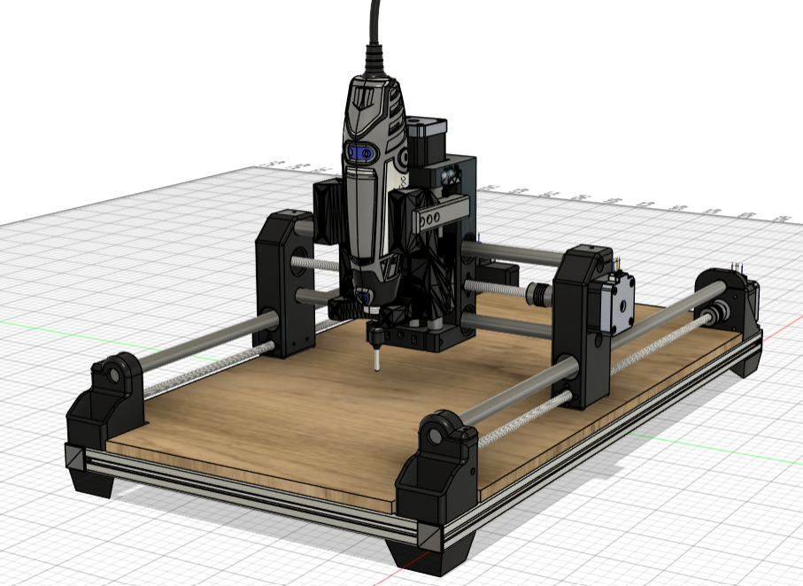

# CNC PCB - DIY 3D Printed Dremel CNC

Este repositório contém os arquivos de firmware, modelos 3D para impressão e arquivos de projeto para a construção de uma fresadora CNC de precisão, ideal para a prototipagem rápida de Placas de Circuito Impresso (PCBs) e usinagem de materiais leves (MDF, acrílico, plásticos).

O design mecânico e estrutural deste projeto é baseado na famosa máquina open-source **[DIY 3D Printed Dremel CNC](https://www.instructables.com/DIY-3D-Printed-Dremel-CNC/)** desenvolvida por **Nikodem Bartnik**.

---

## 📂 Estrutura do Repositório

*   📁 **`Firmware/`**: Contém o arquivo compactado `grbl-master.zip` com o código-fonte estável do **GRBL v0.9j** para gravação no Arduino Uno.
*   📁 **`Modelo2D/`**: Desenhos 2D e layouts vetoriais para corte e furação de componentes.
*   📁 **`Modelo3D/`**: Arquivos de modelo 3D (arquivos STL) das peças de fixação e suportes estruturais para serem fabricados via Impressão 3D.

---

## 🔌 Especificações Técnicas Principais

*   **Área de Trabalho Útil:** Ajustável (no projeto padrão: aprox. 220mm x 380mm x 60mm).
*   **Guias Lineares:** Eixos retificados de aço carbono de 12mm de diâmetro (LM12UU).
*   **Movimentação:** Fusos trapezoidais T8 (passo de 2mm, avanço de 8mm/volta) acoplados a motores de passo **NEMA 17** (Modelo 17HS4401).
*   **Controladora:** Arduino Uno R3 acoplado com **CNC Shield V3.00**.
*   **Drivers de Motor:** **A4988** com microstepping configurado em 1/16 de passo (resolução de 400 passos/mm).
*   **Cabeçote Spindle:** Microrretífica **Dremel 3000** (ou similar de mercado de 130W a 180W).

---

## 📖 Documentação Completa na Wiki

Para guias detalhados sobre todas as fases de construção e operação do projeto, acesse a **[Wiki deste Repositório](https://github.com/pedro4896/CNC_PCB/wiki)**. A documentação está dividida nas seguintes seções:

1.  **[BOM - Lista de Materiais](https://github.com/pedro4896/CNC_PCB/wiki/BOM)**: Lista exata de perfis de alumínio, rolamentos, fusos, eletrônica, motores e ferragens necessárias.
2.  **[Guia de Montagem Física](https://github.com/pedro4896/CNC_PCB/wiki/Montagem)**: Passo a passo ilustrado de montagem mecânica e alinhamento fino dos eixos para evitar travamento mecânico.
3.  **[Eletrônica e Esquema Elétrico](https://github.com/pedro4896/CNC_PCB/wiki/Eletronica-e-Esquema)**: Esquema de ligação dos motores de passo, fim de curso, alimentação lógica/de potência, jumpers de microstepping e ajuste do limite de corrente ($V_{ref}$) nos potenciômetros dos drivers A4988.
4.  **[Firmware e Configuração do GRBL](https://github.com/pedro4896/CNC_PCB/wiki/Firmware-e-GRBL)**: Como gravar o código do GRBL v0.9j no Arduino Uno via Arduino IDE e tabelas com as configurações recomendadas dos parâmetros de software (`$`).
5.  **[Calibração e Operação](https://github.com/pedro4896/CNC_PCB/wiki/Calibracao-e-Operacao)**: Fórmulas de passos por milímetro, ajuste fino mecânico, fluxo de trabalho completo da PCB (do software de CAD Gerber ao G-Code via FlatCAM) e utilização da ferramenta de **Heightmap** no Candle para compensar o desnível da placa cobreada na usinagem.

---

## 🚀 Como Começar

1.  **Preparação Mecânica:** Imprima as peças localizadas em `Modelo3D/` e adquira as peças mecânicas listadas na página de BOM da Wiki.
2.  **Montagem:** Siga o Guia de Montagem para estruturar a parte física e o chassi de alumínio 20x20.
3.  **Configuração Eletrônica:** Conecte o Arduino, CNC Shield, A4988 (atente para a orientação física do potenciômetro metálico voltado para baixo!) e regule a tensão de $V_{ref}$ para cerca de `0.8V` a `0.9V` com um multímetro.
4.  **Instalação do Firmware:** Extraia o `grbl-master.zip` da pasta `Firmware`, adicione a subpasta `grbl` interna à IDE do Arduino como biblioteca ZIP e grave o exemplo `grblUpload` em sua placa.
5.  **Calibração e Teste:** Use o software Candle para enviar seus primeiros comandos de movimentação e calibrar a precisão dos eixos.

---

## 🎥 Vídeos e Tutoriais

Para auxiliar no processo de montagem e calibração da máquina, assista à playlist oficial do projeto no YouTube:
*   **[Playlist Oficial DIY Dremel CNC (YouTube)](https://www.youtube.com/watch?v=HpL547Ndej4&list=PL2WNyP4cr1yz_UZvhduWa3cA6ylVMLebW)** - Série de vídeos ensinando a configurar uma CNC desse tipo.
---

## 🤝 Créditos e Licença

*   Projeto original criado por **Nikodem Bartnik** ([Nikodem Bartnik](https://www.instructables.com/DIY-3D-Printed-Dremel-CNC/)).
*   Firmware GRBL desenvolvido pela comunidade open-source.
*   Este projeto é de código aberto para fins acadêmicos, de estudo e maker.
